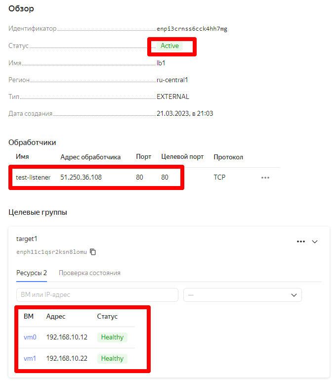

# Домашнее задание к занятию 10.7 «Отказоустойчивость в облаке» Андрей Дёмин


## Задание 1 

Возьмите за основу [задание 1 из модуля 7.3 «Подъём инфраструктуры в Яндекс Облаке»](https://github.com/netology-code/sdvps-homeworks/blob/main/7-03.md#задание-1).

Теперь вместо одной виртуальной машины сделайте terraform playbook, который:

- создаст 2 идентичные виртуальные машины. Используйте аргумент [count](https://www.terraform.io/docs/language/meta-arguments/count.html) для создания таких ресурсов;
- создаст [таргет-группу](https://registry.terraform.io/providers/yandex-cloud/yandex/latest/docs/resources/lb_target_group). Поместите в неё созданные на шаге 1 виртуальные машины;
- создаст [сетевой балансировщик нагрузки](https://registry.terraform.io/providers/yandex-cloud/yandex/latest/docs/resources/lb_network_load_balancer), который слушает на порту 80, отправляет трафик на порт 80 виртуальных машин и http healthcheck на порт 80 виртуальных машин.

Рекомендую почитать [документацию сетевого балансировщика](https://cloud.yandex.ru/docs/network-load-balancer/quickstart) нагрузки для того, чтобы было понятно, что вы сделали.

Далее установите на созданные виртуальные машины пакет Nginx любым удобным способом и запустите Nginx веб-сервер на порту 80.

```yaml

---
- hosts: 158.160.24.7 158.160.17.28
  remote_user: user
  become: yes
  become_method: sudo
  gather_facts: no
  tasks:

    - name: Install Nginx
      apt: name=nginx update_cache=yes state=latest

    - service:
        name: nginx
        state: started
        enabled: yes

    - name: checking service status
      command: systemctl status "{{ item }}"
      with_items:
        - nginx
      register: result
      ignore_errors: yes

    - name: showing report
      debug:
        var: result
```


Далее перейдите в веб-консоль Yandex Cloud и убедитесь, что: 

- созданный балансировщик находится в статусе Active,
- обе виртуальные машины в целевой группе находятся в состоянии healthy.

Сделайте запрос на 80 порт на внешний IP-адрес балансировщика и убедитесь, что вы получаете ответ в виде дефолтной страницы Nginx.

*В качестве результата пришлите:*

*1. Terraform Playbook.*

```

terraform {
  required_providers {
    yandex = {
      source = "yandex-cloud/yandex"
    }
  }
}

provider "yandex" {
  token     = "**********************************************************" ###### OAuth-token
  cloud_id  = "********************"                                       ###### Идентификатор облака (cloud-dem-in-aa)    
  folder_id = "********************"                                       ###### Идентификатор каталога (default)
  zone      = "ru-central1-b"
}

resource "yandex_compute_instance" "vm" {
count  = 2
  name = "vm${count.index}"
  resources {
    core_fraction = 20
    cores         = 2
    memory        = 2
  }

  boot_disk {
    initialize_params {
      image_id = "fd8tq7bdl10k819vprud"
      size     = 5 
    }
  }

  network_interface {
    subnet_id = yandex_vpc_subnet.subnet-1.id
    nat       = true
  }

  metadata = {
    user-data = "${file("./meta.yaml")}"
  }
}

resource "yandex_vpc_network" "network-1" {
  name = "network1"
}

resource "yandex_vpc_subnet" "subnet-1" {
  name           = "subnet1"
  zone           = "ru-central1-b"
  network_id     = "${yandex_vpc_network.network-1.id}"
  v4_cidr_blocks = ["192.168.10.0/24"]
}

resource "yandex_lb_target_group" "target-1" {
  name        = "target1"

  target {
    subnet_id = yandex_vpc_subnet.subnet-1.id
    address   = yandex_compute_instance.vm[0].network_interface.0.ip_address
  }

  target {
    subnet_id = yandex_vpc_subnet.subnet-1.id
    address   = yandex_compute_instance.vm[1].network_interface.0.ip_address
  }
  }

resource "yandex_lb_network_load_balancer" "lb-1" {
  name = "lb1"
  listener {
    name = "test-listener"
    port = 80
    external_address_spec {
      ip_version = "ipv4"
    }
  }

  attached_target_group {
    target_group_id =  yandex_lb_target_group.target-1.id
    healthcheck {
      name = "http"
        http_options {
          port = 80
          path = "/"
        }
    }
  }
}

output "internal-vm-1" {
  value = "${yandex_compute_instance.vm[0].network_interface.0.ip_address}"
}

output "external-vm-1" {
  value = "${yandex_compute_instance.vm[0].network_interface.0.nat_ip_address}"
}

output "internal-vm-2" {
  value = "${yandex_compute_instance.vm[1].network_interface.0.ip_address}"
}

output "external-vm-2" {
  value = "${yandex_compute_instance.vm[1].network_interface.0.nat_ip_address}"
}

```

---

---

---


*2. Скриншот статуса балансировщика и целевой группы.*


---

---


*3. Скриншот страницы, которая открылась при запросе IP-адреса балансировщика.*


---

Для решения задачи по перенаправлению трафика с порта 80 на порт 8088 и смены location "/" на "/ping" внесены правки в плейбуке terraform:

```

 attached_target_group {
    target_group_id =  yandex_lb_target_group.target-1.id
    healthcheck {
      name = "http"
        http_options {
          port = 8088
          path = "/ping"
        }
    }
  }
}

```

а также в ansible-playbook:

```
---
- hosts: 158.160.11.75 158.160.3.119
  remote_user: user
  become: yes
  become_method: sudo
  gather_facts: no
  tasks:
    - name: Install Nginx
      apt: name=nginx update_cache=yes state=latest

    - service:
        name: nginx
        state: started
        enabled: yes

    - name: checking service status
      command: systemctl status "{{ item }}"
      with_items:
        - nginx
      register: result
      ignore_errors: yes

    - name: showing report
      debug:
        var: result

    - name: Copy the nginx.conf
      ansible.builtin.copy:
        src:  /etc/nginx/nginx.conf
        dest: /etc/nginx/nginx.conf
        owner: user
        group: user
        mode: '0644'
        backup: yes
      register: restart_nginx

    - name: Copy file One to sites-enabled
      ansible.builtin.copy:
        src: /etc/nginx/sites-enabled/one
        dest: /etc/nginx/sites-enabled/one
        owner: user
        group: user
        mode: '0644'
        backup: yes
      register: restart_nginx

    - name: restart nginx
      service:
        name: nginx
        state: restarted

```

---
## Задание 2*

Теперь, вместо создания виртуальных машин, создайте [группу виртуальных машин с балансировщиком нагрузки](https://cloud.yandex.ru/docs/compute/operations/instance-groups/create-with-balancer).

Nginx нужно будет поставить тоже автоматизированно. Для этого вам нужно будет подложить файл установки Nginx в user-data-ключ [метадаты](https://cloud.yandex.ru/docs/compute/concepts/vm-metadata) виртуальной машины.

- [Пример файла установки Nginx](https://github.com/nar3k/yc-public-tasks/blob/master/terraform/metadata.yaml).
- [Как подставлять файл в метадату виртуальной машины.](https://github.com/nar3k/yc-public-tasks/blob/a6c50a5e1d82f27e6d7f3897972adb872299f14a/terraform/main.tf#L38)

Далее перейдите в веб-консоль Yandex Cloud и убедитесь, что: 

- созданный балансировщик находится в статусе Active,
- обе виртуальные машины в целевой группе находятся в состоянии healthy.

Сделайте запрос на 80 порт на внешний IP-адрес балансировщика и убедитесь, что вы получаете ответ в виде дефолтной страницы Nginx.

*В качестве результата пришлите*

*1. Terraform Playbook.*

*2. Скриншот статуса балансировщика и целевой группы.*

*3. Скриншот страницы, которая открылась при запросе IP-адреса балансировщика.*


